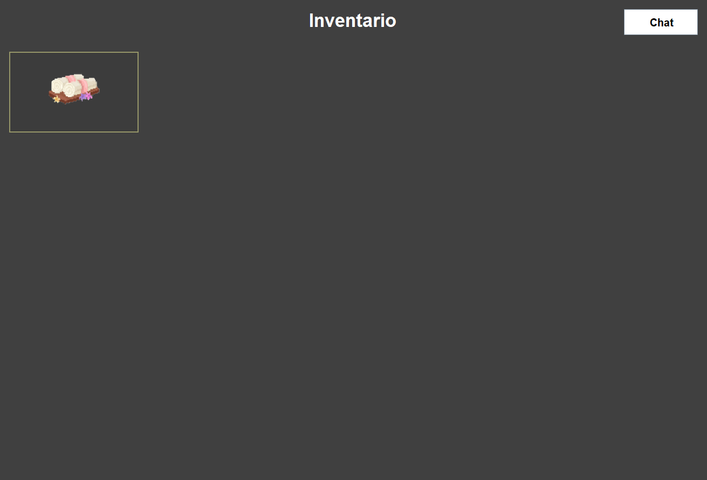

# **The Royal Silk Adventure**
Il progetto è stato presentato dal gruppo **AEG**  per l'**esame di Metodi Avanzati di Programmazione** *M-Z* *A.A. 2025/2026*
### Componenti
- **Andrea Milo**
- **Emanuele Santoruvo**
- **Giulio Murgo**
# Indice
1. [[#Descrizione dell’avventura]]  
2. [[#Progettazione]]
	 2.1 [[#Diagramma delle classi]]
	 2.2 [[#Specifica algebrica]]
	 2.3 [[#Dettagli implementativi]]
3. [[#Informazioni sul lavoro di gruppo e sul progetto]]
# Descrizione dell’avventura
L’avventura consiste nella storia del protagonista **Eryndor**, mercante di tessuti alla ricerca di un titolo nobiliare.

Nel regno si dovranno svolgere le nozze della **Principessa Marien**, ed il Re del regno è alla ricerca del **tessuto** perfetto per il matrimonio.

Da qui inizia il lungo e tortuoso cammino verso il **castello**, che avrà diversi imprevisti ed **enigmi** da risolvere incontrando diversi personaggi che lo ostacoleranno o lo aiuteranno nel suo percorso.

Avventuratevi e scoprite se il nostro protagonista riuscirà a raggiungere il suo obiettivo, e qual è il suo **vero obiettivo….**

Per consultare la **trama completa nel suo sviluppo** e visualizzare gli **enigmi con la loro soluzione** e spiegazione matematica, visualizzare il file [**Trama.md**](Idee%20trama/Trama.md)
# Progettazione
Le classi sono state individuate a partire da un'analisi del **dominio del problema** e dei **casi d'uso** del gioco.

Ad ogni classe è stato assegnato il principio della **singola responsabilità (SRP)**: ogni classe è stata pensata per avere una sola ragione di cambiamento. Da qui la scelta di separare, ad esempio, la logica di un enigma (`Enigma`) dalla sua rappresentazione grafica (`DialogueScreen`, `DialogoOrdinamentoVestiti`) e dalla sua persistenza (`ModelDB`).

Dove più classi condividevano attributi e comportamenti comuni si è introdotta una **gerarchia di ereditarietà** ( es.  `Enigma` come base astratta dei tre tipi di enigma). Dove invece serviva un contratto comune senza condivisione di implementazione si è usata un'**interfaccia** (`GiveObject`).

#### Organizzazione in package
L'applicazione è strutturata secondo il pattern architetturale **MVC (Model–View–Controller):**

| Package | Ruolo | Contenuto |
| --- | --- | --- |
| `aeg.giocomap` | Entry point | `GiocoMAP` (metodo `main`) |
| `aeg.giocomap.View` | **View** – interfaccia grafica (Swing) | `MainFrame`, `GameScreen`, `DialogueScreen`, `ChatPanel`, `MappaPanel`, `InventarioPanel`, … |
| `aeg.giocomap.GameEngine` | **Controller** – orchestrazione e logica di gioco | `GameEngine`, `SceneManager`, `GameStatistics`, `NavigazioneMappa`, `TimerEnigma`, … |
| `aeg.giocomap.Model` | **Model** – dominio, suddiviso in sotto-package | vedi sotto |
| `aeg.giocomap.Network` | Modulo multiplayer (chat) | `GameServer`, `GameClient`, `ClientHandler`, `Message`, … |
| `aeg.giocomap.Util` | Utilità trasversali | `JsonLoader`, `Parser`, `CursorUtil` |

Il **Model** è ulteriormente scomposto per area di responsabilità:

- `Model.Enigmi`: `Enigma`, `EnigmaTestuale`, `EnigmaSceltaMultipla`, `EnigmaOrdinamento`, `IstanzaEnigma`
- `Model.Giocatore` : `Giocatore`, `Inventario`
- `Model.Oggetti` : `Oggetto`, `Spada`, `GiveObject`
- `Model.Personaggi` : `Entity`, `Personaggio`, `Fantoccio`
- `Model.Stanza` : `Stanza`
- `Model.Storage` : `ModelDB`, `ModelTXTOggetti`

L'idea base è stata quella di massimizzare la **coesione interna**  e minimizzare l'**accoppiamento tra package**. Le dipendenze fluiscono coerentemente con MVC: la View non conosce il Model se non attraverso il Controller; il `GameEngine` (Controller) coordina Model e View; il Model non dipende né dalla View né dal Controller.

#### Controller — `aeg.giocomap.GameEngine`

- **`GameEngine`** : è il **controller** centrale creato dal `main`. Riceve gli input, coordina Model e View e mantiene lo stato di alto livello della partita (scena da salvare, dialogo attivo). Precarica i database dei dialoghi/storia/hint (JSON), istanzia `ModelDB`/`ModelTXTOggetti`, `SceneManager` e la rete, e gestisce il ciclo di gioco (`avviaGioco`, `salvaEdEsci`, mostra dialoghi con NPC e wall-of-text).
- **`SceneManager`** : gestisce il **cambio di scena** e la cache dei pannelli. Sa quale scena è correntemente mostrata (per il salvataggio), gestisce gli overlay (mappa, puntatore, inventario, chat) e ripristina la scena sottostante alla loro chiusura, delegando a `MainFrame` la visualizzazione concreta.
- **`GameStatistics`** : tiene il **punteggio** e le statistiche di sessione: avvia/chiude gli enigmi (`iniziaEnigma`, `enigmaRisolto`), calcola i punti in base al tempo impiegato (`calcolaPunti`) tramite `TimerEnigma`.
- **`TimerEnigma`** : cronometra la risoluzione di un enigma, fornendo a `GameStatistics` il tempo impiegato.
- Oltre alle classi mostrate, il package comprende alcune classi di supporto al controller: **`StatoProgressione`** conserva lo stato di avanzamento della partita e si appoggia all'enum **`StatoStoria`**, che elenca in ordine le tappe narrative; **`CostruttoreScene`** costruisce le scene di gioco (sfondi, personaggi, enigmi) ed è usata da `ProgressioneStoria`, mentre **`FlussiNarrativi`** gestisce le sequenze narrative complesse ed è composta da `CostruttoreScene`. **`MusicPlayer`**, infine, riproduce le tracce audio ed è richiamata dal `GameEngine`, senza dipendere da altre classi del progetto.

#### Model — dominio
Esistono vari package Model che gestiscono logiche di back in base al compito da svolgere, favorendo così l'**incapsuletion hiding**, di seguito vengono riportati con le loro classi:

- **Enigmi (`Model.Enigmi`)**:
	- **`Enigma`** *(astratta)*:  Definisce lo stato comune (`id`, `testo`, `aiuti`, `reward`, `risolto`) e la risposta `verifica(risposta)`, lasciato astratto perché ogni tipo di enigma valida la risposta in modo diverso (**polimorfismo**).
	- **`EnigmaTestuale`**: enigma a risposta libera: confronta la risposta con una `soluzione`.
	- **`EnigmaSceltaMultipla`**: enigma a opzioni: valida l'indice/valore scelto tra le `opzioni`.
	- **`EnigmaOrdinamento`**: enigma in cui va ricostruito l'ordine corretto (es. sequenza di vestiti), con `verificaPosizione` per la validazione parziale.
	- Il package include anche **`IstanzaEnigma`**, che funge da costruttore concreto degli enigmi: carica testi e aiuti dai file JSON (tramite `JsonLoader`) e istanzia il tipo di `Enigma` appropriato, restituendo l'oggetto `Oggetto` da assegnare come ricompensa.

* **Giocatore (`Model.Giocatore`)**

	- **`Giocatore`**: rappresenta lo **stato del giocatore**: nome, possesso di mappa/inventario, insieme degli enigmi risolti. Espone le operazioni sul progresso (`aggiungiEnigmaRisolto`, `isEnigmaRisolto`) e possiede un `Inventario`.
	- **`Inventario<T>`**: collezione **generica** di oggetti posseduti dal giocatore (aggiunta/rimozione/ricerca).

- **Oggetti (`Model.Oggetti`)**

	- **`Oggetto`**: entità  raccoglibile/utilizzabile, identificata da `idOggetto`, `nome`, `descrizione`.
	- **`Spada`**: oggetto speciale che implementa `GiveObject`: reagisce alla risoluzione di un enigma (`reagisciRisoluzioneEnigma`) e gestisce una carica (`caricaSincro`) con soglia massima.
	- **`GiveObject`** *(interfaccia)*: contratto per gli oggetti che devono **reagire** al completamento di un enigma; disaccoppia chi risolve l'enigma dall'oggetto che ne subisce l'effetto.

- **Personaggi (`Model.Personaggi`)**

	- **`Entità`** *(astratta)*: base di tutti i personaggi, incapsula il `nome`.
	- **`Personaggio`**: NPC con albero di dialoghi: gestisce l'avanzamento delle battute (`parla`, `setDialoghi`, `resetDialogo`).
	- **`Fantoccio`**: personaggio "muto"/decorativo, specializzazione minimale di `Personaggio`

- **Storage (`Model.Storage`)**

	- **`ModelDB`**:  connessione, salvataggio/caricamento partita (`salvaPartita`, `loadGame`), gestione record e punteggi.
	- **`ModelTXTOggetti`**: carica il **catalogo degli oggetti** da file di testo in una `Map<Integer, Oggetto>`, fungendo da sorgente dati per gli oggetti di gioco.

- **Model (`Model.Stanza`)**
	Gestisce il salvataggio della stanza adiacente, il nome della stanza da salvare per il DB e il `Map<String, Stanza>` per gestire la stanza, da stringa da prendere a stanza restituita.

####  View — `aeg.giocomap.View`

- **`MainFrame`**: la **finestra principale** (`JFrame`). Ospita i pannelli delle scene tramite un `JLayeredPane`, gestisce elementi sempre in sovraimpressione (bottone chat, frecce di navigazione, effetti) e il ridimensionamento. È l'unico punto di ingresso grafico verso cui il Controller invia i pannelli da mostrare.
- **`GameScreen`**: pannello che **disegna una scena** di gioco: renderizza l'immagine di sfondo e registra le zone cliccabili (hotspot) associate ad azioni (`Runnable`).
- **`DialogueScreen`**: schermata di **dialogo/enigma**: mostra testo, opzioni e aiuti e raccoglie la risposta del giocatore.
- **`InventarioPanel` / `MappaPanel`**: overlay per **inventario** e **mappa**, mostrati sopra la scena corrente e gestiti dal `SceneManager`.
  



- **`ChatPanel`**: pannello grafico della **chat multiplayer**: area messaggi, campo di input e invio. Fa da ponte tra la View e il `GameClient` del package Network.


#### Network — `aeg.giocomap.Network`
Modulo autonomo che implementa una **chat multiplayer** con architettura **client-server su socket TCP**.

- **`GameNetwork`**: Coordina l'avvio come **host** (`GameServer` + `GameClient` locale) o l'ingresso come client (`connettiComeClient`), rileva l'IP locale da **condividere** e collega il `ChatPanel` alla connessione.
- **`GameServer`** *(Runnable)*: il **server**: apre il `ServerSocket` sulla porta, accetta le connessioni creando un `ClientHandler` per ciascun client, gestisce l'elenco dei nomi connessi (**unicità**) e il **broadcast** dei messaggi a tutti.
- **`GameClient`**: il **client**: si connette al server, invia messaggi (`invia`) e avvia il `ThreadRicezione` per l'ascolto asincrono.
- **`ClientHandler`** *(Runnable)*: gestisce **un singolo client** lato server, su **thread** dedicato: legge i messaggi in arrivo, verifica i nomi duplicati e inoltra al server per il broadcast (*JOIN/CHAT/LEAVE*).
- **`ThreadRicezione`** *(Runnable)*: thread di **ricezione asincrona** dei messaggi lato client; formatta i messaggi ricevuti e notifica la View tramite callback (`SwingUtilities.invokeLater`), garantendo l'aggiornamento sul thread grafico.
- **`Message`**: oggetto  che modella un messaggio (tipo, mittente, contenuto).
- **`TipoMessaggio`** *(enum)*: tipi di messaggio del protocollo: `JOIN`, `LEAVE`, `CHAT`, `NOME_DUPLICATO`.
- **`MessageParser`**: **serializzazione/deserializzazione** dei messaggi in stringhe da trasmettere sul socket (formato `tipo|mittente|contenuto`), incapsulando il protocollo di comunicazione.

#### Util — `aeg.giocomap.Util`
Raccolta di classi di supporto trasversali, senza logica di dominio:

- **`JsonLoader`**: lettura dei database JSON di dialoghi/storia/hint
- **`Parser`**: parsing di dati testuali
- **`CursorUtil`**: gestione del cursore e delle **zone cliccabili** nelle scene

####  Strumenti esterni utilizzati

- **Mermaid**: per la stesura dei diagrammi UML (diagramma delle classi, e volendo diagrammi di sequenza/stato per i flussi di gioco e di rete).
- **Gson**: libreria per la (de)serializzazione JSON, usata da `JsonLoader` per leggere i file di dialoghi/storia/hint.
- **H2**: database relazionale embedded usato da `ModelDB` per il salvataggio/caricamento delle partite.
- **Java Swing**: libreria grafica per l'interfaccia utente (`MainFrame`, `GameScreen`, `DialogueScreen`, pannelli overlay), con zone cliccabili responsive basate su percentuali (`CursorUtil`) per adattarsi al ridimensionamento della finestra.
- **Socket TCP**: per il modulo di rete multiplayer (`GameServer`/`GameClient`),

## Diagramma delle classi

[Cliccare qui per visualizzare l’UML.](UML%20e%20design/UML%20delle%20classi.png)

Il diagramma delle classi rappresenta la struttura del sistema: le classi, i loro attributi e metodi e le relazioni che le legano. Si è fatto uso dei principali meccanismi della progettazione a oggetti **astrazione**, **classi astratte**, **ereditarietà**, **interfacce** e **composizione** (insieme alle altre forme di associazione), descritti di seguito.

Attraverso l'**astrazione** e l'**incapsulamento**, ogni entità espone unicamente la propria interfaccia pubblica necessaria, mantenendo privato e nascosto il proprio stato interno (come avviene, ad esempio, per le proprietà della classe `Oggetto`). Per modellare i concetti più generali si è fatto ricorso alle **classi astratte** e all'**ereditarietà**. L'astratta `Entity` accomuna le basi di tutti i personaggi e viene specializzata da `Personaggio` e `Fantoccio`; similmente, la classe `Enigma` centralizza gli attributi condivisi ma delega alle sue tre sottoclassi l'implementazione specifica del metodo di verifica, applicando di fatto il **polimorfismo**.

L'architettura è ulteriormente disaccoppiata dall'uso delle **interfacce**, come `GiveObject`, che definiscono contratti di comportamento (realizzati concretamente da classi come `Spada`) svincolando i dettagli implementativi.

Infine, le **relazioni tra le classi** sono state modellate con diversi gradi di intensità per riflettere le reali interazioni del gioco. Troviamo:
- legami forti di **composizione**, utilizzati quando un elemento dipende vitalmente da un altro e ne condivide il ciclo di vita (come il `Giocatore` che genera e possiede il proprio `Inventario`).
- Si passa poi all'**aggregazione**, utile per raggruppare elementi che mantengono una loro esistenza autonoma (come gli oggetti che vengono semplicemente raccolti o eliminati momentaneamente). 
- Connessioni più deboli e momentanee, definite di **dipendenza** o **associazione**.
  Queste ultime servono per **scambi temporanei di dati che non richiedono un legame fisso**. Un chiaro esempio è la risoluzione delle sfide: la classe astratta `Enigma` produce il risultato limitandosi a esporre metodi come `verifica(String risposta)`, `getId()` e `getReward()`, ma non conosce né tiene riferimenti a classi come `GameStatistics` o all'`Inventario`. A sua volta, `GameStatistics` consuma il risultato per calcolare il punteggio tramite il metodo `enigmaRisolto(Enigma)`, non mantiene un campo persistente per l'enigma, ma lo riceve solo come parametro al volo, ne estrae i dati utili (come la ricompensa o il timer) e lo scarta. In modo del tutto simile, l'`Inventario<T Oggetto extends>` incamera la ricompensa tramite il metodo `aggiungiOggetto(T oggetto)`, invocato passandogli l'oggetto transitoriamente.
  
  Il ruolo di far dialogare queste componenti è affidato a classi orchestratrici come `CostruttoreScene` e `FlussiNarrativi`: sono loro a fungere da mediatori creando l'enigma, chiamando il metodo `verifica()`, funzione astratta che verifica la correttezza della soluzione, adattato in base alla tipologia d'enigma (inserimento, testuale, scelta multipla) e, in caso di esito positivo, invocando le funzioni opportune del Controller (come `engine.getStatistics().enigmaRisolto(enigma)` e `inventario.aggiungiOggetto(...)`).
## Specifica algebrica
La specifica algebrica implementata è quella della struttura dati **Insieme**. Abbiamo utilizzato questa struttura dati per gestire **l'inventario del giocatore**.

Il tipo parametro _tipoelem_ è istanziato con **Oggetto (`Inventario<T extends Oggetto>`)**. L'uguaglianza $x=y$ su _tipoelem_ è definita per nome (`getNomeOggetto()` confrontato con `equalsIgnoreCase`), coerentemente con `cercaOggetto`: due oggetti con lo stesso nome sono lo stesso elemento.
#### Specifica sintattica

- **Tipi:** insieme, boolean, tipoelem

- **Operazioni:**

	• `creainsieme () -> insieme`

	• `insiemevuoto (insieme) -> boolean`

	• `appartiene (insieme, tipoelem) -> boolean`

	• `inserisci (insieme, tipoelem) -> insieme`

	• `cancella (insieme, tipoelem) -> insieme`

	• `uguale (insieme, insieme) -> boolean`
#### Specifica semantica

**Dichiarazione variabili da usare:**

- `A, A'`: **insieme**
- `x,y`: **tipoelem**  
- `b`: **boolean**

**Tabella delle osservazioni**:

| **Osservazione**       | **Costruttore di A': creainsieme ()** | **Costruttore di A': inserisci (A, x)**                    |
| ---------------------- | ------------------------------------- | ---------------------------------------------------------- |
| **insiemevuoto (A')**  | True                                  | False                                                      |
| **appartiene (A', y)** | False                                 | If x = y then true<br><br>else appartiene (A, y)           |
| **cancella (A', y)**   | Error                                 | If x = y then A<br><br>else inserisci (cancella (A, y), x) |

**Regole di valutazione:**

- `insiemevuoto (creainsieme ()) = true`

- `insiemevuoto (inserisci (A, x)) = false`

- `appartiene (creainsieme (), y) = false`

- `appartiene (inserisci (A, x), y) = If x = y then true else appartiene (A, y)`

- `cancella (inserisci (A, x), y) = If x = y then A else inserisci (cancella (A, y), x)`

- `inserisci (inserisci (A, x), y) = If x = y then inserisci (A, x) else inserisci (inserisci (A, y), x)`

L'ultimo assioma esprime le due proprietà caratteristiche dell'insieme: l'inserimento di un elemento già presente lascia l'insieme **invariato e l'ordine di inserimento è irrilevante**.

**Specifica di restrizione**

`cancella (creainsieme (), y) = error`

#### *Implementazione nuovo operatore binario: uguale (insieme, insieme) -> boolean*

*A, B: insieme;   b: boolean;   x, y: tipoelem*

| **uguale (B', A')**                     | **Costruttore di A': creainsieme ()** | **Costruttore di A': inserisci (A, x)**                                                                                                                  |
| --------------------------------------- | ------------------------------------- | -------------------------------------------------------------------------------------------------------------------------------------------------------- |
| **Costruttore di B': creainsieme ()**   | True                                  | False                                                                                                                                                    |
| **Costruttore di B': inserisci (B, y)** | False                                 | If x = y then uguale (B, A)<br><br>else if appartiene (A, y) and appartiene (B, x) <br>then uguale (cancella (B, x), cancella (A, y)) <br><br>else false |

**Regole di valutazione:**

- `uguale (creainsieme (), creainsieme ()) = true`
  
- `uguale (creainsieme (), inserisci (A, x)) = false`
  
- `uguale (inserisci (B, y), creainsieme ()) = false`
  
- `uguale (inserisci (B, y), inserisci (A, x)) = If x = y then uguale (B, A) else if appartiene (A, y) and appartiene (B, x) then uguale (cancella (B, x), cancella (A, y)) else false`

Poiché l'insieme non è ordinato, nel caso in cui i due elementi confrontati siano diversi non è corretto concludere immediatamente false: si verifica tramite *appartiene* che ciascuno dei due sia **presente nell'altro** insieme e si ricorre sugli insiemi privati di tali elementi.

#### *Implementazione nuovo operatore binario: inclusione (insieme, insieme) -> boolean*

*A, B: insieme;   b: boolean;   x, y: tipoelem*

| **inclusione (B', A')**                 | **Costruttore di A': creainsieme ()** | **Costruttore di A': inserisci (A, x)**                                                        |
| --------------------------------------- | ------------------------------------- | ---------------------------------------------------------------------------------------------- |
| **Costruttore di B': creainsieme ()**   | True                                  | True                                                                                           |
| **Costruttore di B': inserisci (B, y)** | False                                 | If appartiene (inserisci (A, x), y)<br>then inclusione (B, inserisci (A, x))<br><br>else false |

**Regole di valutazione:**

• inclusione (creainsieme (), creainsieme ()) = true

• inclusione (creainsieme (), inserisci (A, x)) = true

• inclusione (inserisci (B, y), creainsieme ()) = false

• inclusione (inserisci (B, y), inserisci (A, x)) = If appartiene (inserisci   (A, x), y) then inclusione (B, inserisci (A, x)) else false

si verifica che ogni singolo elemento estratto dal primo insieme appartenga al secondo. Non appena si incontra un elemento mancante, la valutazione restituisce false; in caso contrario, prosegue fino allo svuotamento del primo insieme, confermando l'inclusione.

## Dettagli implementativi

### Programmazione generica

Le **Generics** nel progetto vengono utilizzate per estendere le **liste e le mappe** nel gioco così da non far prendere qualsiasi tipo di dato dalle `HashMap` ma per definire esattamente che tipo di dato deve contenere la **collezione di dati** e senza fare il **casting** dal tipo oggetto al tipo corretto.
Un esempio lo si trova nella **gestione della mappa e delle uscite** nel file `Stanza.java`:

``` JAVA
private final Map<String, Stanza> uscite;
// ...
public void impostaUscita(String direzione, Stanza stanza) {
    uscite.put(direzione.toUpperCase(),stanza);
}
```

Qui l'**uscita** da una stanza viene salvata in questa `HashMap` dove la chiave è la stringa della direzione (che nel codice viene definito che può essere uno dei **punti cardinali**) e l'oggetto è la `stanza` di destinazione.

Una **Generics nuova**, creata direttamente per il gioco è stata ideata nel package `Giocatore` per la gestione del suo `Inventario`. Se si analizza il codice della classe `Inventario` si nota come la sintassi `<T extends Oggetto>` definisce la sua regola di accettare solamente le istanze della classe `Oggetto` e le sue sottoclassi annesse (`Spada`).
Con questa implementazione evitiamo di dover controllare l'inserimento di tipi non validi quando vengono usate le funzioni di aggiunta di un oggetto all'inventario e di ricerca di quest'ultimo:

```JAVA
public class Inventario<T extends Oggetto> {

    // La lista non cambia, cambiano i contenuti all'interno
    private final List<T> listaOggetti; 

    public Inventario() {
        this.listaOggetti = new ArrayList<>();
    }

    public void aggiungiOggetto(T oggetto) {
        if (cercaOggetto(oggetto.getNomeOggetto()) == null) {
            listaOggetti.add(oggetto);
        }
    }

    public void rimuoviOggetto(T oggetto) {
        listaOggetti.remove(oggetto);
    }
       
    public T cercaOggetto(String nome) {
        return listaOggetti.stream()
                .filter(obj -> obj.getNomeOggetto().equalsIgnoreCase(nome))
                .findFirst()
                .orElse(null);
    }

    public List<T> getListaOggetti() {
        return listaOggetti;
    }
}
```

Alla luca di questa implementazione se torniamo ad analizzare `Giocatore` e specificamente in questa sezione di codice:

```JAVA
import aeg.giocomap.Model.Oggetti.Oggetto;
public class Giocatore {
    private final String nome_lore;
    private String nome_player;
    private Inventario<Oggetto> inventario;
    
    //...
    
    public Inventario<Oggetto> getInventario(){
        // creamo l'inventario solo alla prima chiamata
        if(this.inventario==null) this.inventario=new Inventario<>();
        
        // se non esiste da questo inventario perché non ha ancora quello esistente
        return this.inventario;
    }
}
```

si nota come l'istanza di inventario venga da subito specificata che conterrà un oggetto di tipo `Oggetto` (si precisa che c'è una grande differenza tra `Oggetto` e `Object`, anche se Java è basato sulla classe `Object`, quest'ultima non è `Oggetto`, poiché quest'ultima gestisce gli **oggetti del gioco**).
Così la funzione `Inventario<Oggetto> getInventario()` sia vincolata all'uso di quel tipo di dato.

Oltre all'implementazione di classi generiche create da noi, il progetto fa un uso nativo della programmazione generica di Java attraverso il *Java Collections* per le **liste**: `List<String> alberoDialoghi` nella classe `Personaggio` e `List<ClientHandler> clientConnessi` in `GameServer`.
### File

Nel progetto usiamo **due approcci differenti** per la lettura dai **file**.
I file usati generalmente vengono gestiti con `getResourceAsStream` per estrarre la **posizione fisica** di quel file, questa metodologia viene eseguita per i file **JSON**, i quali contengono i **dialoghi** e le frasi a schermo del gioco, i file `.wav` per la **musica** letta tramite l'apposita classe e libreria e per le **immagini** `.png` del gioco.
Mentre per il **catalogo degli oggetti** usiamo il `FileReader("src/main/resources/oggetti/oggetti.txt")`, che a differenza del metodo precedente legge solo **flussi di carattere** e non immagini e suoni e all'interno della classe `ModelTXTOggetti.java`, il costruttore utilizza un percorso relativo, il `FileReader` dice al sistema operativo di iniziare a cercare a partire dalla cartella da cui è stato avviato il programma (questo ovviamente in base a chi gioca al gioco può essere diverso come percorso, ma partendo da `src`, che è unico per tutti, non crea problemi).

Siamo consci che per un ottimo videogioco *"pubblicabile"* era buona prassi usare **solamente una delle due implementazioni** e tra le due implementazioni la migliore è quella usata per i JSON, ma abbiamo preferito mostrare anche la seconda metodologia per mostrare a livello di progetto universitario la padronanza di entrambe.

#### JSON
La gestione dei file viene pensata principalmente per i file JSON, centralizzati nella classe `JsonLoader`:

```JAVA
import com.google.gson.*;
import java.io.*;

//...

public class JsonLoader {
    
    public static JsonObject caricaJson(String percorso){
        try{
            InputStream is = JsonLoader.class.getResourceAsStream(percorso);
            if(is == null){
                System.err.println("File JSON non trovato: " + percorso);
                return null;
            }
            BufferedReader reader = new BufferedReader(new InputStreamReader(is, "UTF-8"));
            return JsonParser.parseReader(reader).getAsJsonObject();
        }
        catch(JsonIOException | JsonSyntaxException | UnsupportedEncodingException e){
            System.err.println("Errore lettura JSON " + percorso + ": " + e.getMessage());
            return null;
        }
    }
    
	// ...

```

In questo metodo della classe `JsonLoader` andiamo a caricare il file JSON specificato dal `percorso`, così da poterlo utilizzare (come vedremo dopo). Il JSON viene aperto tramite `InputStream` e viene letto tramite `BufferedReader` con specifica **UTF-8** per poter prendere gli accenti nelle `TextArea` dei dialoghi, come mostrato nella foto seguente:

![[utf-8_mostrato.png|506]]

Il metodo restituisce `null`, così da non dover far bloccare il gioco in caso di dialogo mancante, ma proseguirebbe senza quella parte di dialogo. Ovviamente nella **console** durante i test di gioco veniva mostrato questo messaggio per verificarne l'esattezza.

Come anticipato prima, questo metodo viene richiamato in `GameEngine` dove i tre file JSON dei dialoghi vengono caricati inizialmente e tenuti in memoria per tutta la partita così da **non doverli rileggere** ogni volta che servivano:
```JAVA
this.dbWallOfText = JsonLoader.caricaJson("/dialoghi/walloftext.json");
this.dbStoria = JsonLoader.caricaJson("/dialoghi/dialoghi_storia.json");
this.dbHint = JsonLoader.caricaJson("/dialoghi/dialoghi_hint.json");
```

I file sono tre, gestiti tutti da **chiave - valore** nel JSON così da richiamare ad ogni scena la chiave di quella frase e contengono rispettivamente:
- dialoghi lunghi per la narrazione (`walloftext.json`)
- dialoghi della trama principale, tra cui enigmi e discorsi dei personaggi (`dialoghi_storia.json`):
```JSON
...
  
"Marien": {
	"presentazione_enigma": "Viandante, vorresti risolvere tu, come tutti i qui presenti, il problema che io stessa ho ideato.\nDovete sapere tutti che fino ad ora nessuno è mai riuscito a risolverlo e io sono una grande amante delle sfide che richiedono cervello.\nNemmeno il mio promesso sposo Jack è mai riuscito a risolverlo. A tal punto, non diteglielo quando arriverà qui in stanza o andrà su tutte le furie.",

...

```
- dialoghi dei consigli alle soluzioni degli enigmi, soluzioni trovabili consultando zone e NPC del gioco (`dialoghi_hint.json`)
#### TXT
Una gestione diversa riguarda invece il catalogo degli oggetti ottenibili, definito nel file di testo `oggetti.txt` e caricato dalla classe `ModelTXTOggetti`. A differenza dei JSON qui usiamo un formato a righe ideato appositamente per il progetto, così da comprendere i 10 oggetti da inizio gioco e assegnarli nell'inventario quando saranno effettivamente ottenuti, con i campi separati dal carattere `;`:

```JAVA
private void loadOggettiDaCatologo(){
        catalogoOggetti = new HashMap<>();
        
        try{
            //Leggiamo il file
            BufferedReader reader=new BufferedReader(new FileReader("src/main/resources/oggetti/oggetti.txt"));
            
            // Fin tanto che la linea letta da file non è nulla...
            while ((linea=reader.readLine())!=null) {
                //... e fin tanto che non è vuota..
                if (linea.trim().isEmpty()){
                    continue;
                }
                /* 
                ... allora divido la linea in diverse parti dove trovo
                il punto e virgola (deciso tra noi come separatore nel file)
                e poi salvo tutto in 3 parti, in modo da istanziare
                */
                String[] parti=linea.split(";",3);
                
                if (parti.length==3){
                    try {
                        // Rimuovo gli spazi bianchi tramite trim()
                        currentId = Integer.parseInt(parti[0].trim());
                        currentNome = parti[1].trim();
                        currentDesc = parti[2].trim();
                        inserisciOggetto(currentId, currentNome, currentDesc);
                    } catch (NumberFormatException e) {
                        System.err.println("DEBUG: Impossibile convertire ID in numero sulla linea n."+linea);
                    }
                } else {
                    System.err.println("DEBUG: Formato della riga non valido, attese 3 parti:"+ linea);
                }
            }
                reader.close();
                System.out.println("DEBUG: Catalogo oggetti: "+ catalogoOggetti.size()+" presenti all'interno");
        }
        catch(IOException e){
            System.out.println("DEBUG: Errore imprevisto: " + e);
        }
    }
```

Ogni riga del file rappresenta un oggetto nel formato `id;nome;descrizione` (es. `1;Tessuto;Il prezioso tessuto da consegnare al Re di Shambhala.`); il metodo `split(";", 3)` divide la riga in massimo tre parti, così che eventuali `;` presenti nella descrizione non spezzino ulteriormente la stringa. Così da visualizzare nell'inventario queste caratteristiche e caricare nell'inventario, in base al momento nella storia, l'oggetto con **id**: $n$.

![[Inventario.png]]

#### PNG
Le **immagini** sono basati sulla libreria standard `javax.imageio.ImageIO`. Il caricamento è **dinamico**, dove il nome del file non è scritto nel codice ma viene costruito a runtime a partire da un **dato di gioco**. Lo si vede bene in `InventarioPanel`, dove lo *sprite* di ogni oggetto viene recuperato usando il nome dell'oggetto stesso come nome del file:

```java
String nomeFileImmagine = obj.getNomeOggetto() + ".png";
InputStream is = getClass().getResourceAsStream("/sprites/Oggetti/" + nomeFileImmagine);

if (is != null) {
    BufferedImage img = ImageIO.read(is);
    Image scaledImage = img.getScaledInstance(90, 90, Image.SCALE_SMOOTH);
    iconLabel.setIcon(new ImageIcon(scaledImage));
} else {
    iconLabel.setText(obj.getNomeOggetto().substring(0,1));
}
```

Questo approccio evita di dover mappare manualmente ogni oggetto al proprio file immagine: basta rispettare la convenzione **"nome oggetto = nome file"** nella cartella delle risorse.
Comunque in caso non venga trovato, nel ramo `else` viene gestito un metodo per far apparire comunque l'oggetto, tramite la sua lettera iniziale nella **griglia visiva dell'inventario**. Stessa logica viene gestita per gli scenari, solo che se non viene trovato viene impostato a `null`, mostrando schermo nero senza far bloccare il gioco.
#### WAV
La musica è gestita dalla classe `MusicPlayer`, che si appoggia alla libreria `javax.sound.sampled` per riprodurre file `.wav` in loop continuo:

```JAVA
public void playMusic(int i){
    try{
	    //Seleziono la traccia dall'array (usato come lettore di canzoni)
        BufferedInputStream bs = new BufferedInputStream(getClass().getResourceAsStream(tracceAudio[i])); 
	    
	    // Traduce il wav nel formato leggibile java
        AudioInputStream as = AudioSystem.getAudioInputStream(bs); 
        clip = AudioSystem.getClip();
        clip.open(as); // Inseriamo la traccia loop dentro il lettore java
        clip.loop(Clip.LOOP_CONTINUOUSLY);
	    clip.start();
    }
    catch (IOException | LineUnavailableException | UnsupportedAudioFileException e){
        System.out.println("DEBUG: Traccia numero "+i+" non trovata "+ e.getMessage());
    }
}
```

Come possiamo notare, viene detto che si usa un array per gestire il *"nastro musicale"* del player delle canzoni, di fatto i percorsi delle tracce sono definiti in un **array di stringhe nel costruttore** della classe, così da poter essere richiamati altrove nel codice tramite **costanti** (`MusicPlayer.TITLE_SCREEN_MUSIC`, `MusicPlayer.END_TITLE_MUSIC`) invece che con indici numerici scritti a mano, così da poter ampliare il `MusicPlayer`, in caso si vogliano aggiungere altre tracce.

```JAVA
public static final int TITLE_SCREEN_MUSIC = 0;
    public static final int END_TITLE_MUSIC = 1;
    
    // Costruttore con tutte le tracce audio
    public MusicPlayer(){
        tracceAudio = new String[3];
        
        tracceAudio[0] = "/musiche/GreenlandsTitleScreen.wav"; //Ttile screen
        tracceAudio[1] = "/musiche/DEAFKEVEndTitle.wav"; // End Screen
        //tracceAudio[2] = "traccasuccessiva";
    }
```
### Database (JDBC)

bla bla bla…

### Lamba Expression (compresi stream e pipeline)

bla bla bla…

### SWING

bla bla bla…

### Thread e programmazione concorrente

bla bla bla…

### Socket e/o REST

bla bla bla…

# Informazioni sul lavoro di gruppo e sul progetto
La suddivisione dei compiti all'interno del gruppo è avvenuta in modo concreto, tramite consultazione: ognuno ha scelto di occuparsi delle parti che gli interessavano o in cui si sentiva più a suo agio, senza una vera e propria assegnazione dall'alto. Anche la divisione dei compiti, pur essendo nata in modo naturale e senza una pianificazione rigida, si è rivelata efficace, il che ha reso il lavoro più rapido.
#### Architettura e gestione del codice

- **Pattern architetturale:** Dal punto di vista architetturale abbiamo scelto di seguire il pattern **MVC**, separando la logica di gioco (**Model**), l'interfaccia grafica (**View**) e il coordinamento tra le due (**Controller - GameEngine**).
    
- **Gestione tramite repository:** Per la gestione del codice abbiamo lavorato su **GitHub**, utilizzando branch separati per le diverse funzionalità e aprendo **pull request** per unire il lavoro sul **branch principale**. Questo approccio ci ha permesso di rivedere le modifiche prima di integrarle ed evitare conflitti quando lavoravamo in parallelo sulle stesse parti del progetto.
#### Punti di forza e difficoltà

- **Comunicazione efficace:** Il punto di forza principale del gruppo è stata la comunicazione: ci siamo confrontati spesso in chiamata su **Discord**, il che ha reso più semplice tenere tutti allineati sullo stato di avanzamento e risolvere velocemente eventuali dubbi o blocchi.
    
- **Risoluzione dei conflitti:** La difficoltà principale è stata gestire alcuni conflitti di merge su GitHub, soprattutto nei momenti in cui più persone lavoravano in parallelo su parti del codice che finivano per toccarsi (ad esempio quando modifiche diverse interessavano le stesse classi o gli stessi file di configurazione). Li abbiamo risolti confrontandoci direttamente sulle modifiche prima di integrarle, il che ci ha fatto capire l'importanza di comunicare in anticipo quando si stava per toccare una parte condivisa del codice, piuttosto che scoprirlo solo al momento della pull request. Un altra difficoltà incontrata è stato ritrovarci molto spesso con delle **GodClass**, così da attuare varie separazioni su file paralleli del lavoro che eseguiva un solo file, così da comprendere a pieno quanto sia importante l'**incapsulamento** e la **suddivisione dei compiti** che deve gestire ogni file senza mischiare i compiti di una classe con un altra e astrarre i compiti il più possibile.
#### Asset esterni e funzionalità accantonate

- **Grafica:** Per quanto riguarda la parte grafica, le immagini di base sono state reperite su **Pinterest** e poi ritoccate tramite **AI generativa** per adattarle allo stile e alle esigenze del gioco, purtroppo nessuno del team sa disegnare e volevamo tanto fare la parte grafica.
    
- **Audio:** Per l'audio abbiamo invece attinto a librerie di suoni **free-copyright** reperite su **YouTube**.
    
- **Idee non implementate:** Tra le funzionalità accantonate per motivi di tempo, la più significativa era l'idea di un **finale alternativo**, che sarebbe dovuto comparire in modo casuale con una probabilità **randomica**, startata ad avvio del gioco molto bassa (circa 1 su 1000). È un'idea che avrebbe aggiunto rigiocabilità al progetto, ma che abbiamo scelto di non implementare per concentrare il tempo a disposizione sulle funzionalità madre del gioco.

---
# NOTE VALUTATIVE e IMPLEMENTATIVE CHE SARANNO TOLTE DA QUESTO FILE, SERVONO SOLO ORA IN VIA DI SVILUPPO

## Idea originale
L'idea di base è basata sull'ispirazione data dai giochi Monkey Island e Phoenix Wright per un'avventura grafico-testuale.
### La trama rispetto al codice
Abbiamo adattato la trama per poter coincidere con le richieste fatte dal professore in termini di 
* **OOP, Classi e Proprietà:** La spada sincro che si "ricarica del 30% ad ogni enigma" è l'esempio di un oggetto con una proprietà che cambia durante l'avventura.
* **Enigmi e Thread/Concorrenza:** Per poter calcolare un punteggio, si può utilizzare un thread concorrente all'esecuzione dell'enigma per il calcolo del tempo e del punteggio in base a quest'ultimo.
* **Gestione chat con Sockets e/o REST:** Per poter parlare con altri giocatori che stanno giocando il gioco (in qualunque punto siano) in modo da poterne interagire o parlare con loro
* **Mappa e Luoghi:** Il castello, l'ingresso e le montagne verranno trasformate in una mappa strutturata a grafo o a matrice. 
* **Dialoghi:** L'opzione di scelta multipla (1. Velluto, 2. Seta, ecc.) è utilizzata per semplificare l'interazione nel gioco (rendendolo user-friendly).
### Architettura del Progetto
Divideremo in tre categorie il codice:
#### Package 1: Model (Il Back-end e la Logica)
* **`Stanza` (Room):** Ha un nome, una descrizione e i collegamenti ad altre stanze.
* **`Oggetto` (Item):** Interfaccia o classe astratta. Avrà nome, descrizione e uno score (punteggio, solo per la spada).
* **`Personaggio` (NPC):** Gestisce l'albero dei dialoghi, richiamando opportunamente il suo dialogo prestabilito. Un fantoccio verrà istanziato per poter dare al giocatore i vari oggetti
* **`Giocatore`:** Contiene la posizione attuale (Stanza corrente) e l'`Inventario`.
* **`Inventario` (Generics/Lambda):** Usiamo i Generics per la collezione di oggetti. Usa le **Lambda Expression e gli Stream**  per cercare un oggetto (es. `inventario.stream().filter(obj -> obj.getNome().equals("Chiave")).findFirst()`).
#### Package 2: View (Il Front-end Grafico / SWING)
* **`MainFrame` (JFrame):** La finestra principale, che verrà divisa in due. 
1. Un pannello superiore (`ImagePanel`) che mostra lo sfondo della location corrente (come i cancelli del Castello) e (forse) lo sprite del PG presente. 
2. Un pannello inferiore (`DialogPanel`) contenente una `JTextArea` non modificabile per il testo e un pannello laterale con i pulsanti (`JButton`) per le azioni: "Esamina", "Parla", "Inventario", "Spostati".
#### Package 3: Controller (L'intermediario)
* **`GameEngine`:** Inizializza la mappa e gestisce le interazioni. Quando l'utente preme il pulsante "Prendi Tessuto Reale", il Controller riceve l'input dalla View, chiama il metodo sul Model (es. `giocatore.aggiungi(tessuto)`), e poi dice alla View di aggiornare la casella di testo: "Hai recuperato il Tessuto Reale!". (Facendo un esempio)
## Tecnicismi
### Gestione Database (JDBC): Salvataggi e Ranking
Dato che il gioco non finisce mai in modo prematuro, il database avrà una doppia funzione strutturale fondamentale per l'esperienza del giocatore:
* **Sistema di Salvataggio:** Crea una tabella `Salvataggi`. Quando il giocatore decide di salvare, il database memorizza lo stato esatto di Eryndor: la stanza in cui si trova, gli ID degli oggetti nell'inventario, il punteggio accumulato fino a quel momento.
* **Punteggi (Hall of Fame):** Crea una tabella `Classifica`. Poiché il punteggio si basa sulla velocità di risoluzione degli enigmi tramite i Thread (meno tempo = più punti), alla fine del gioco, quando Eryndor sposa la Principessa Marien, il punteggio finale totale viene salvato nel DB associato al nome del giocatore, che sarà visualizzabile dopo i titoli di coda.
### Gestione File (I/O): Il Copione degli NPC
Nessun dialogo deve essere scritto direttamente nel codice sorgente Java. Questo pulisce il codice e rispetta appieno il requisito dell'uso dei file.

* **File di Testo/JSON:** Creeremo un file dedicato con tutte le battute di Mr.Cooper, Fox, Saggio Clock, Eripeta, David e degli altri personaggi.
* **Lettura all'Avvio:** Durante il caricamento del gioco, una classe dedicata (ipotizziamo `DialogueLoader`) leggerà il file tramite `BufferedReader` o librerie JSON, salvando i dialoghi in una struttura dati appropriata (come una `HashMap` in cui la chiave è il nome dell'NPC e il valore è la lista delle sue battute).
### Interfaccia Grafica e Controlli (SWING & Regex)
* **Puntatore Dinamico (Hotspots):** Sulla `JLabel` o `JPanel` che contiene l'immagine di sfondo, imposteremo un `MouseMotionListener`. Quando le coordinate del mouse entrano in un'"area sensibile" (es. sopra la figura del pescatore o su un oggetto nascosto nell'ambiente ), cambia l'icona del cursore. Un `MouseListener` intercetterà poi il click effettivo.
* **Frecce Direzionali:** Posizioneremo a schermo quattro pulsanti grafici (NORD, SUD, EST, OVEST), quando il giocatore clicca su uno di essi il pulsante innesca l'azione di spostamento. Simuleremo l'esperienza di una avventura testuale in modalità "ibrida" .
* **Analisi Testuale (Regex):** Per i momenti in cui è necessario l'input da tastiera (es. digitare la risposta esatta all'enigma N.7 della Principessa), utilizzeremo le Espressioni Regolari (Regex) per creare un parser. Questa permetterà di ignorare spazi extra, maiuscole/minuscole o parole inutili, catturando solo la parola chiave necessaria per risolvere l'enigma.
